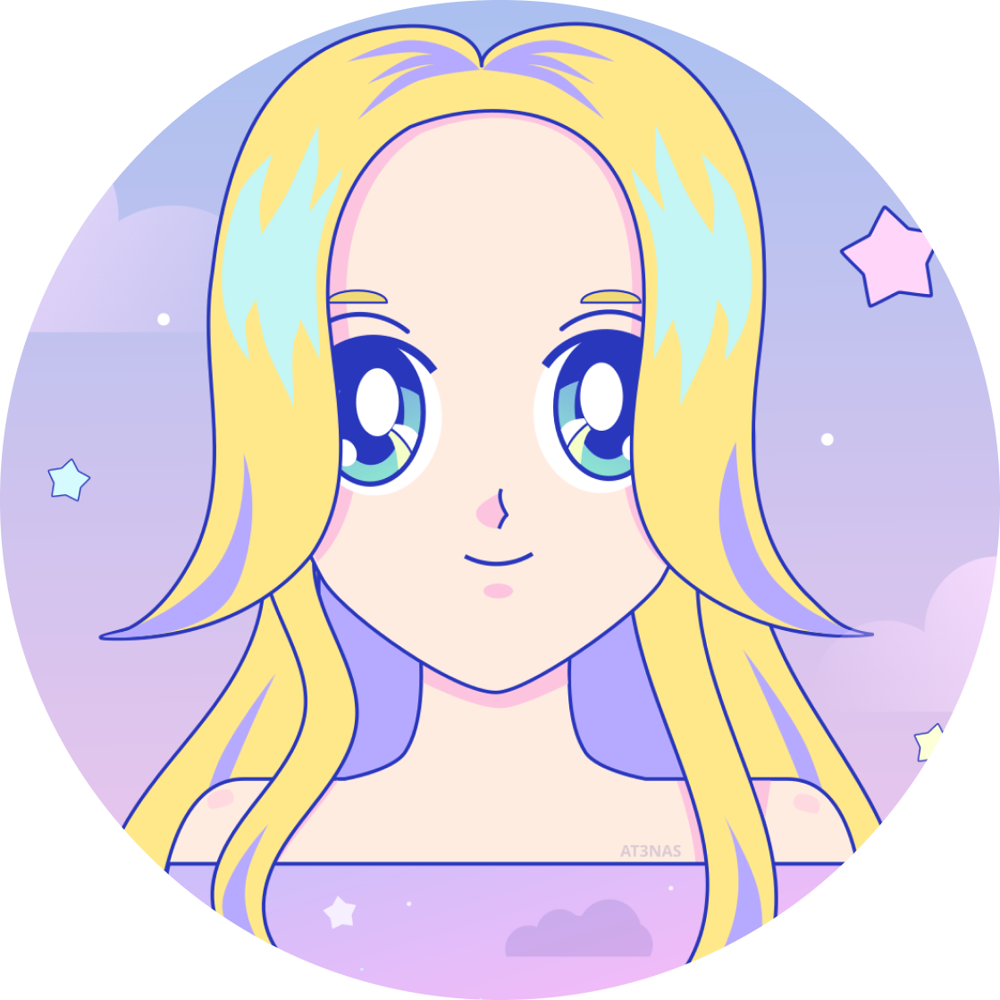
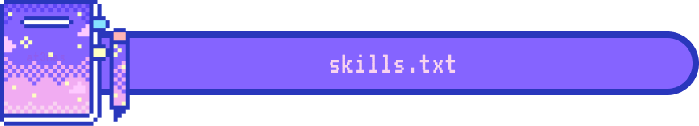

  

  

  

I'm Atenas, a sophomore student majoring in Programming. I mainly focus on Web Development, especially Front End Development, guided by my creative and artistic self. However, I do not limit myself to these and I'm constantly expanding my knowledge in diverse technologies and programming languages.  

  

